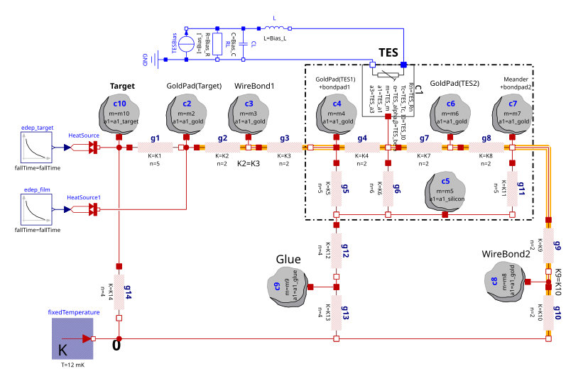

# TES Thermal Model

Modelica models for thermal and electrothermal simulations of Transition Edge Sensor (TES) detectors. The repository contains a reusable component library plus system-level examples for TES biasing, Joule heating, nonlinear thermal links, temperature-dependent heat capacities, and detector response to pulsed energy input.

## Repository Contents

- `libTES.mo` - local Modelica package containing reusable TES thermal-model components.
- `System_1block.mo` - one-block TES system using `libTES.TES2` and nonlinear thermal conductance.
- `System_1block_linearG.mo` - one-block TES system using `libTES.TES` and Modelica's linear `ThermalConductor`.
- `System_LMO.mo` - larger LMO detector thermal network with multiple heat-capacity nodes and conductance links.
- `System_LMO.svg` - exported diagram for the LMO system.
- `parameters/params_lmo_v1.txt` - reference parameter set for the LMO model.

All Modelica source files currently live at the repository root. The reusable components are organized inside `libTES.mo`; the system models instantiate them with qualified names such as `libTES.TES2` and `libTES.ThermlConductanceN`.

## Component Library

`libTES.mo` defines the reusable models used by the system examples:

- `libTES.TES` - TES component with electrical pins, one thermal port, tanh transition resistance, Joule heating, and constant heat capacity.
- `libTES.TES2` - TES variant with temperature-dependent heat capacity, using linear and cubic specific-heat terms.
- `libTES.ThermlConductanceN` - nonlinear thermal conductance between two heat ports:

```modelica
Q_flow = K * (port_a.T^n - port_b.T^n);
```

- `libTES.HeatCapacitorPoly` - thermal mass with polynomial specific heat capacity:

```modelica
cp = a0 + a1*T + a3*T^3 + a5*T^5;
```

## Requirements

Use OpenModelica/OMEdit with the Modelica Standard Library. The system models declare:

```modelica
uses(Modelica(version = "4.1.0"))
```

Install OpenModelica if you want to check or simulate from the command line with `omc`. If OpenModelica reports that the Modelica package is missing, install Modelica 4.1.0 from OMEdit's package manager or through an OpenModelica script.

## Running In OMEdit

Load the local library before loading any system model:

1. Open OMEdit.
2. Select **File > Open Model/Library File(s)** and open `libTES.mo`.
3. Open the system model you want to run, for example `System_1block.mo`, `System_1block_linearG.mo`, or `System_LMO.mo`.
4. In the Libraries Browser, select the system model.
5. Click **Check Model** and fix any reported errors before simulating.
6. Click **Simulate** to run with the experiment settings stored in the model annotation.
7. Open the plotting view and inspect variables such as TES temperature, current, Joule power, heat-capacity values, or conductance outputs.

Recommended starting points:

- Use `System_1block.mo` for the simplest nonlinear TES thermal example.
- Use `System_1block_linearG.mo` to compare against Modelica's linear `ThermalConductor`.
- Use `System_LMO.mo` for the multi-node LMO detector network.

The model annotations store simulation settings so they travel with the files. Current examples include:

- `System_1block.mo`: `StartTime = 0`, `StopTime = 0.04`, `Tolerance = 1e-06`, `Interval = 2e-07`.
- `System_1block_linearG.mo`: `StartTime = 0`, `StopTime = 0.03`, `Tolerance = 1e-06`, `Interval = 1e-07`.
- `System_LMO.mo`: `StartTime = 0`, `StopTime = 100e-3`, `Tolerance = 1e-06`, `Interval = 1e-06`.

### OMEdit Troubleshooting

- If you see `Class libTES... not found`, load `libTES.mo` first, then reload the system model.
- If you see missing `Modelica.Thermal`, `Modelica.Electrical`, or other standard-library classes, install or load Modelica 4.1.0.
- If OMEdit reports a parser error around `addClassAnnotation`, restart OMEdit or clear the scripting input/session, then reload `libTES.mo` and the target system model.
- If a parameter is reported as having neither a value nor a start value, check the parameter declarations in the system model and any parameter file you are using.

## Running From Command Line

Because the system models depend on the local `libTES` package, load `libTES.mo` before checking or simulating a system model. A direct command such as `omc System_LMO.mo` may fail with `Class libTES... not found` if the library is not already loaded.

The most reliable command-line workflow is to create a small `.mos` script for the model you want to run.

### Check `System_LMO`

Create a temporary script such as `check_System_LMO.mos`:

```modelica
loadModel(Modelica, {"4.1.0"});
loadFile("libTES.mo");
loadFile("System_LMO.mo");
checkModel(System_LMO);
getErrorString();
```

Run it from the repository root:

```sh
omc check_System_LMO.mos
```

### Simulate `System_LMO`

Use the same load order, then call `simulate`:

```modelica
loadModel(Modelica, {"4.1.0"});
loadFile("libTES.mo");
loadFile("System_LMO.mo");
simulate(System_LMO);
getErrorString();
```

Run it with:

```sh
omc simulate_System_LMO.mos
```

OpenModelica will use the experiment annotation in `System_LMO.mo` unless you override simulation options in the `simulate(...)` call.

### Check The One-Block Examples

For `System_1block.mo`:

```modelica
loadModel(Modelica, {"4.1.0"});
loadFile("libTES.mo");
loadFile("System_1block.mo");
checkModel(System_1block);
getErrorString();
```

For `System_1block_linearG.mo`:

```modelica
loadModel(Modelica, {"4.1.0"});
loadFile("libTES.mo");
loadFile("System_1block_linearG.mo");
checkModel(System_1block_linearG);
getErrorString();
```

### Generated Files

Simulation from `omc` may create generated C files, object files, an executable, logs, XML/JSON metadata, and result files such as `System_LMO_res.mat` in the working directory. These are build and simulation artifacts; rerun the simulation to regenerate them when needed.

## Modeling Notes

`libTES.TES` and `libTES.TES2` compute TES resistance as:

```modelica
R = Rn/2 * (1. + tanh((T - Tc) * alpha0/Tc));
```

The resulting Joule power is coupled into the thermal balance. For constant heat capacity:

```modelica
C * der(T) = P_Joule + heatPort.Q_flow;
```

For temperature-dependent heat capacity in `libTES.TES2`:

```modelica
cp = a1*T + a3*T^3;
m * cp * der(T) = P_Joule + heatPort.Q_flow;
```

`System_LMO.mo` exposes summary result variables named `A_C*`, `A_T*`, and `A_G*` for selected heat capacities, temperatures, and thermal conductances.

## Modeled Systems

### LMO



## Contributing

Keep model filenames aligned with model names when adding new system models. Prefer `Modelica.Units.SI` types for physical quantities, preserve existing experiment annotations, and document parameter choices that come from detector calibration or measurement data.
